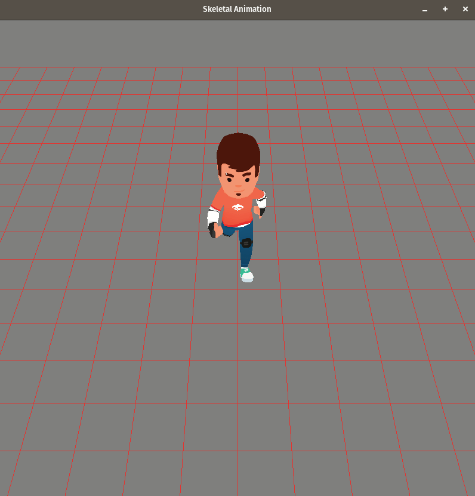

# OpenGL Skeletal Animation

This project showcases an implementation skeletal animation in OpenGL, using C++17.


The implementation is quite rudimentary at the moment, as it only supports keyframe interpolation. It can essentially be seen as a minimum working example (MWE) for skeletal animation.

## Upcoming Features 

* Blending/animation transitions: interpolating between two different animations to get a seamless transition between the two animations.
* Additive blending: this makes it possible to combine two animations, such as combining a leaning animation with a walking or running animation.
* Inverse Kinematics

## Building and Running

The project has only been tested on Linux (Pop!_OS 22.04) so far.

The following dependencies are not currently installed automatically through CMake, so they must be installed manually (
e.g. through `apt`):

* Assimp
* glm
* GLFW3

After installing the dependencies, the project can be compiled using CMake:

```
mkdir build
cd build
cmake ../
make
./opengl-skeletal-animation
```

Alternatively, opening the project using an IDE, such as CLion, should configure the project automatically.


## Credits
The character, animations, and skin were created by [Kenny](https://www.kenney.nl/).